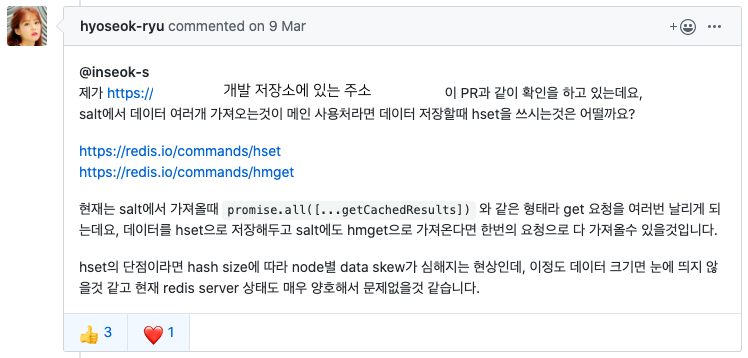

### Table of Contents

1. 개발 진행 배경 🦠  <!-- .element: class="fragment highlight-current-yellow" -->
1. 서비스 개발 통계 📝 <!-- .element: class="fragment highlight-current-yellow" -->
1. 데이터 저장/호출 💾 <!-- .element: class="fragment highlight-current-yellow" -->
1. 배포 & 모니터링 👀 <!-- .element: class="fragment highlight-current-yellow" -->
1. 빠른 개발과 안정적으로 서비스 가능했던 이유 🤔 <!-- .element: class="fragment highlight-current-yellow" -->
1. 후기 ☕️  <!-- .element: class="fragment highlight-current-yellow" -->
1. Q & A ❓ <!-- .element: class="fragment highlight-current-yellow" -->

-----

## 개발 진행 배경 🦠 <!-- .element: class="green" -->

-----

### 공적 마스크

<h4 class="small" style="margin-top: 40px;">2020년 2월 말</h4>

코로나19 확산 🦠
 
마스크 대란 😷🙅‍♂️

<h4 class="small" style="margin-top: 40px;">2020년 3월 4일</h4>
기사: <a href="https://news.joins.com/article/23722020">[현장에서] '앱' 하나로 마스크 대란 잠재운 대만···민관협력이란 이런 것</a>

-----

### 공적 마스크

<h4 style="margin-top: 40px;">2020년 3월 5일</h4>
정부 '마스크 수급 안정화 대책' 발표 🎤
 
1인 2매 약국에서 구입. 3월 9일부터 적용

 

마스크 재고 조회할 수 있는 API 제공하겠다.
 
네이버, 카카오에게 서비스 제공 요청 🙃

 
<strong class="yellow">정부</strong>의 공공 오픈 데이터 제공 + <strong class="yellow">민간</strong>에서 서비스 개발 진행하는 <strong class="yellow">첫 모델 🤝</strong>

-----

### 공적 마스크

<h4 style="margin-top: 40px;">2020년 3월 6일</h4>
네이버 플레이스를 활용해서 대응하기로 결정 👌
 
오후 3시 9분 개발 담당 github enterprise에 issue 등록
 
=> 우리도 잘 대응해 보자! 🤓

 <!-- .element: style="height:200px" class="fragment"-->

-----

#### 공적 마스크

 <!-- .element: style="height:600px" -->

-----

### 잔여 백신

<h4 class="small" style="margin-top: 40px;">2021년 5월 초</h4>

백신💉 물량 공급 부족 + 노쇼 발생 🙄
 

<h4 class="small" style="margin-top: 40px;">2021년 5월 5일</h4>
기사: <a href="https://www.hankookilbo.com/News/Read/A2021050513390000161">백신 버려지는 일 없게… '접종 노쇼 알림' 앱 만든다</a>

-----

### 잔여 백신

<h4 style="margin-top: 40px;">2021년 5월 12일</h4>
잔여백신 수량 확인은 네이버 플레이스를 활용해서 대응하기로 결정 👌
 
 
개발 담당 github enterprise에 issue 등록
 
 => 다시 한 번 잘 대응해 보자! 🤓

 <!-- .element: style="height:200px" class="fragment"-->

-----

## 서비스 개발 통계 📝 <!-- .element: class="green" -->

-----

### 공적 마스크 개발 통계

 <!-- .element: style="height:130px"-->

- 293 commits<!-- .element: class="fragment highlight-current-yellow" -->
- 85 Pull Requests<!-- .element: class="fragment highlight-current-yellow" -->
- 75 files changed<!-- .element: class="fragment highlight-current-yellow" -->
- +2,360 lines & -100 lines<!-- .element: class="fragment highlight-current-yellow" -->

- PR 당 commit 수: 약 3.4개
- commit당 line 변경 수: 약 8.3 line

-----

### 잔여 백신 개발 통계

 <!-- .element: style="height:100px"-->

- 84 commits<!-- .element: class="fragment highlight-current-yellow" -->
- 54 Pull Requests<!-- .element: class="fragment highlight-current-yellow" -->
- 61 files changed<!-- .element: class="fragment highlight-current-yellow" -->
- +5,001 lines & -191 lines<!-- .element: class="fragment highlight-current-yellow" -->

- PR 당 commit 수: 약 1.5개
- commit당 line 변경 수: 약 62 line

-----

## 데이터 저장/호출 💾 <!-- .element: class="green" -->

-----

### API 호출하는데 데이터를 저장해야해?

  전 국민적인 관심사 + 네이버서비스 =  폭발적인 트래픽 🌋
  API 바로 호출은 API 제공하는 쪽에 트래픽 부담

-----

### 그럼 API cache는 어때?

  사용자 좌표별로 응답값이 다름
   
  cache hit 율이 떨어짐
   
   
  👉 데이터 전체를 가져와 저장하자 💾

-----

### 서비스 필요 요건

- 업체(약국/병원) key로 재고 현황 조회
- 검색에 노출하기 위해서는 500ms 이하로 목록 조회와 잔여 재고 현황 조회가 일어나야 함

-----

### HOW?

- redis를 DB로 사용하자
- 짧은 시간(1분, 5초) 마다 전체 데이터 업데이트 하는 job을 돌리자<!-- .element: class="fragment" -->

-----

### redis?

- Memory DB로 빠른 속도
- key/value 조회에 최적화
- Inmemory DB로 휘발성

- 지나간 데이터는 의미 없는 데이터이기 때문에 휘발성이 문제되지 않음
- 플레이스는 다년간 자체 redis cluster 운영 경험이 있음 👌

-----

### 데이터 저장하기

- kubernetes cronjob 이용<!-- .element: class="fragment" -->
  - 5초 단위로 API 호출하여 전체 데이터 업데이트<!-- .element: class="fragment" -->
  - k8s cronjob 최소 단위 1분<!-- .element: class="fragment" -->
  - -> 1분에 12번 호출하는 job 생성<!-- .element: class="fragment" -->
- Expire 여부 체크 -> 유효한 시간 알 수 있는 별도 필드 추가<!-- .element: class="fragment" -->
- 데이터 변경시 로깅 잘 남기기<!-- .element: class="fragment" -->

-----

### 데이터 호출하기

- 주변 업체 목록 조회(1회) + 약국별 재고 조회(N회)
- = N+1 Query Problem<!-- .element: class="fragment" -->
- -> GraphQL DataLoader 사용 - batching & caching<!-- .element: class="fragment" -->
- 주변 업체목록 조회(1회) + 업체별 재고 조회(1회) = 2회 호출 😎<!-- .element: class="fragment" -->

-----

### 호출 조금 더 최적화

redis의 <strong class="yellow">hset / hmget</strong> 사용
 <!-- .element: style="height:400px"-->

-----

## 배포 & 모니터링 👀 <!-- .element: class="green" -->

-----

### N2C cluster 여유분 &
### HPA 최대 대응치 확인

 <!-- .element: style="height:400px"-->

-----

### redis cluster 점검

- 가용 여분 메모리 확인
- connection 개수 점검
 <!-- .element: style="height:400px"-->

-----

### 배포 후 모니터링 - HPA

 <!-- .element: style="height:300px"-->

-----

### 배포 후 모니터링 - grafana

 <!-- .element: style="height:500px"-->

-----

### 배포 후 모니터링 - redis

 <!-- .element: style="height:100px"-->

-----

 <!-- .element: style="height:500px"-->

-----

## 빠른 개발 & 안정적인 서비스 <!-- .element: class="green" -->
## 가능했던 이유 🤔 <!-- .element: class="green" -->

-----

### 리팩토링을 통한 잘 구조화된 코드

- Component 구분 잘 되어 있음 👉 빠른 개발 🚀<!-- .element: class="fragment" -->
- 적극적인 PR 리뷰 & test code 👉 코드 안정성 증가<!-- .element: class="fragment" -->
- 업종별 독립된 구성 / 업무 로테이션 👉 side effect 최소화<!-- .element: class="fragment" -->
- Layer 분리를 잘 해놓음 👉 질의어 처리 / 업종 분류 / 서비스<!-- .element: class="fragment" -->
- 업종 확장을 위한 구조 설계 👍<!-- .element: class="fragment" -->

👉 리팩토링은 비용이 아닌 투자

-----

### 플레이스서비스 기술스택

<strong class="yellow">TypeScript Web Fullstack</strong>

- Node.js with koa<!-- .element: class="fragment" -->
- React with hooks<!-- .element: class="fragment" -->
- GraphQL for API<!-- .element: class="fragment" -->
- MongoDB / ElasticSearch / redis<!-- .element: class="fragment" -->
- kubernetes with N2C<!-- .element: class="fragment" -->

-----

### 기획 & 디자인 & 개발 효율적인 협업

- github enterprise 이슈로 다 같이 의사소통
- 👉 중간에 전달해야하는 의사소통 비용 없음
- 급한건은 채팅방에서 ⚡️

-----

### 전사적인 긴밀한 협업 지원

- POI플랫폼 - 외부 API key 값을 내부 업체ID에 맵핑 작업
- 검색API - 요청량 폭증에 대비한 가용량 점검
- 통합 검색 트래픽 대응
- N2C - 신속한 가용량 확보

-----

## 후기 ☕️ <!-- .element: class="green" -->

-----

### 후기

- Hackday 같았던 개발 🔥
- 서비스 자신감+
- 동료애+ 👨‍👩‍👧‍👦
- 힘들었지만 사명감을 가지고 진행했던 과제 - 출시 후 반응에서 보람 🤗

-----

## Q & A ❓ <!-- .element: class="green" -->
