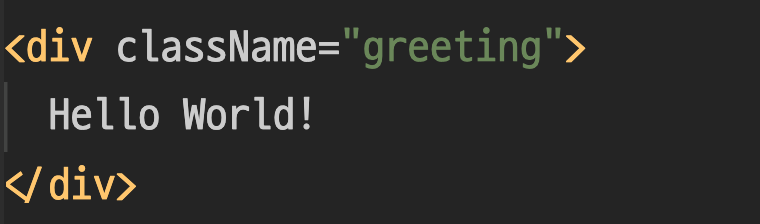

### React Element <!-- .element: class="green" -->

-----

#### React Element(JSX)

- `type`과 `props`를 가지는 <strong class="yellow">JS Object</strong>
- syntatic sugar => jsx

<div class="center-code">

```js [1,5|2|3|4|]
React.createElement(
  'div', // type
  { className: 'greeting' }, // props
  'Hello World!' // children
)
```

 <!-- .element: class="fragment" style="height:150px"-->

</div>

-----

<div class="center-code">

```jsx
// with jsx
<button className='button-blue'>
  <b>
    OK!
  </b>
</button>

```

```js
// without jsx
React.createElement(
  'button',
  { className: 'button-blue' },
  React.createElement(
    'b',
    null,
    'OK!'
  )
);
```
<!-- .element: class="fragment" -->

</div>

-----

#### JSX transform

<div class="center-long-code">

```js
const hello = <h1 className='greeting'>Hello World!</h1>;
```

```js
var hello = React.createElement(
  'h1',
  { className: 'greeting' },
  'Hello World!'
);

// or

var hello = _jsx('h1', { className: 'greeting', children: 'Hello World!' })
```

<!-- .element: class="fragment" -->

</div>

<small class="fragment">참고: [What's a JSX Transform?](https://ko.reactjs.org/blog/2020/09/22/introducing-the-new-jsx-transform.html#whats-a-jsx-transform)</small>

-----

- JSX = React Element
- (HTML tag 형태를 한 JS Object)<!-- .element: class="fragment" -->

-----

#### JSX 태그 규칙

- 기본 html 태그는 소문자로 시작
- 사용자 정의 Component는 대문자로 시작
- HTML과 달리 모든 태그는 self-closing 가능
- 자식 태그를 가질 수 있음
- dot notation 사용 가능

-----

#### JSX에 JS 표현식 사용 가능

- JS expressions 들어가야 하는 부분에 `{}` 넣고 사용
- JS expressions를 자유롭게 사용 가능
  - 함수 호출식
  - 삼항 연산
  - 문자열
  - 배열
  - ...
- 표현식 구분?! => 변수에 담을 수 있는가?<!-- .element: class="fragment" -->

-----

#### JS 표현식 사용하기 예제

```js
function formatName(user) {
  return user.firstName + ' ' + user.lastName;
}

const user = {
  firstName: 'Harper',
  lastName: 'Perez'
};

const element = (
  <h1>
    Hello, {formatName(user)}!
  </h1>
);

ReactDOM.render(
  element,
  document.getElementById('root')
);
```

-----

#### JSX attribute

- `key={value}` 형태로 전달 (단, string은 `''`나 `""` 사용 가능)
- `if`, `for`, `while` 같은 제어는 밖에서 사용해야함
- XSS(cross-site-scripting) 기본 대응

-----

#### 실제 html DOM과 다른 JSX attribute [#](https://reactjs.org/docs/dom-elements.html)

- [`<input>`]`checked`: 동적 할당, 초기값 - `defaultChecked`
- [`<input>, <textarea>`]`value`: 동적 할당, 초기값 - `defaultValue`
- `innerHTML` => `dangerouslySetInnerHTML` [#](https://reactjs.org/docs/dom-elements.html#dangerouslysetinnerhtml)
- `class` => `className`
- `for` => `htmlFor`
- `style` [#](https://reactjs.org/docs/dom-elements.html#style)

-----

#### JSX 주의 사항

- (React 17 이전 버전 사용시) JSX 코드 scope 안에 React 선언 필요 (참고: [new jsx transfrom](https://reactjs.org/blog/2020/09/22/introducing-the-new-jsx-transform.html))
- 실제 DOM은 아니다.(Virtual DOM)
- Single parent
- white space - 기본적으로 `trim()` 제공
- conditional jsx
