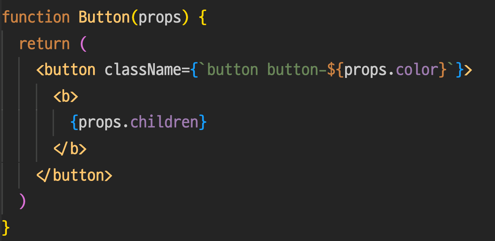

### React Component <!-- .element: class="green" -->

-----

### React Component

<p class="fragment white">
  function(props)
  <span class="fragment"> => </span>
  <span class="fragment">React Element</span>
</p>

<div class="fragment">

- <strong class="yellow">props</strong>를 전달 받아 <strong class="yellow">React Element</strong>를 반환하는 <strong class="yellow">function 혹은 class</strong>
- React element tree를 encapsulate
- 재사용성을 높여주고 기능별 단위를 만들 수 있게 해준다.

</div>

-----

#### React Component

 <!-- .element: style="height:350px" -->

-----

<div class="center-code">

```js
  <Button color='blue'>
    OK!
  </Button>
```

```js
React.createElement(
  Button,
  { color: 'blue' },
  'OK!'
);

{
  type: Button,
  props: {
    color: 'blue',
    children: 'OK!'
  }
}
```

<!-- .element: class="fragment" -->

</div>

-----

### Component 구현 2가지 방법

1. Function Component
1. Class Component: Extends React.Component(or React.PureComponent)

-----

### Props

<div class="center-code">

```jsx
const element = <Greeting name="아무개" />;
```

</div>

<div style="font-size: 27px">

- user-defined Component에 전달되는 [jsx attribute](#attribute)

</div>

-----

### Props 규칙

<div style="font-size: 30px">

- single object<!-- .element: class="fragment highlight-current-yellow" -->
- props의 기본값은 true<!-- .element: class="fragment highlight-current-yellow" -->
- String으로 넘길때는 ""로 바로 전달 - html unescape 됨<!-- .element: class="fragment highlight-current-yellow" -->
- ...(spread operator) 사용하여 prop 전달 가능<!-- .element: class="fragment highlight-current-yellow" -->
- 태그 내부의 값은 props.children으로 전달<!-- .element: class="fragment highlight-current-yellow" -->

</div>

-----

### Props 주의사항

<div style="font-size: 30px">

- props는 read-only<!-- .element: class="fragment highlight-current-yellow" -->
- Array로 React element를 반환하는 경우 `key` prop을 꼭 추가한다<!-- .element: class="fragment highlight-current-yellow" -->
  - `key`는 해당 array 사이에서 unique 해야 함
  - 배열 요소의 최상위 element에 key prop을 할당해야 함
  - array의 index는 가급적 key 사용 지양(최후의 수단으로만 사용)
  - key 사용 이유: [diff algorithm](https://reactjs.org/docs/reconciliation.html#recursing-on-children)

</div>

-----

> *All React components must act like <strong>pure functions</strong> with respect to their props.*

-----

#### Children

<div>children으로 넣을 수 있는 것</div>

<div style="font-size: 30px; padding-top: 40px;">

- Array of React elements
- Javascript expression
- Function as children [#](https://reactjs.org/docs/jsx-in-depth.html#functions-as-children)
  - 참고: [render-prop](https://reactjs.org/docs/render-props.html)

</div>

-----

##### Children 주의사항

<div style="font-size: 30px; padding-top: 40px;">

- `Booleans`, `null`, `undefined` 는 무시됨
  - `falsy` 값 중 `0`은 render 되므로 conditional render 할 때 주의
  - 값을 그대로 render 하고 싶다면 stringify 할 것

</div>
