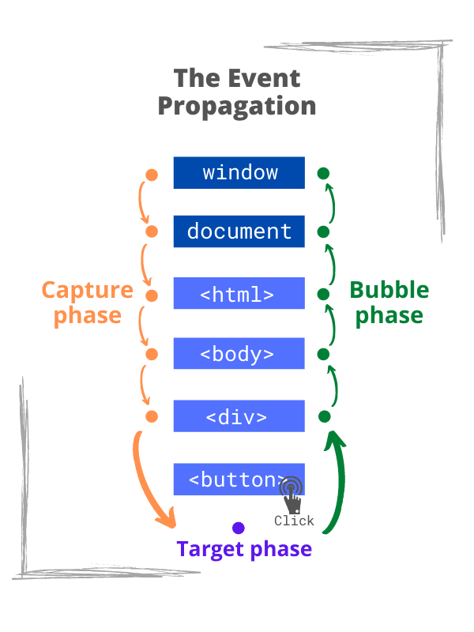

### React event Handling<!-- .element: class="green" -->

-----

#### React에서 Event 다루는 방법

 👉 Event Delegation<!-- .element: class="fragment" -->

-----

 <!-- .element: style="height:600px" -->

-----

 <!-- .element: style="height:600px" -->

-----

#### React event

- 실제 DOM elementdml event handling과 비슷<!-- .element: class="fragment highlight-current-yellow" -->
- event callback 함수에 전달되는 event 객체는 React에서 합성한 event 객체(syntheticEvent)<!-- .element: class="fragment highlight-current-yellow" -->
- 실제 event 객체에 접근하기 위해서는 e.nativeEvent 사용<!-- .element: class="fragment highlight-current-yellow" -->

-----

#### React의 syntheticEvent

  

    <ul style="padding-top: 30px;">
      <li>native event를 wrapping 한 <strong class="yellow">syntheticEvent</strong>를 사용</li>
      <li>cross browser 대응을 해주기 때문에 사용이 편리</li>
    </ul>
  

  

    <iframe
      data-src="https://reactjs.org/docs/events.html"
      data-preload
      width="600px"
      height="500px"
      allowTransparency="true"
      style="background: #FFFFFF;"
    ></iframe>
  

