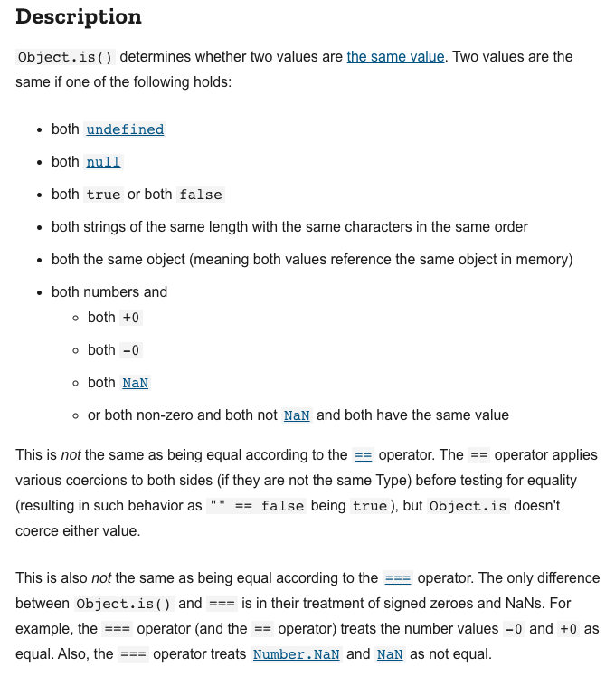
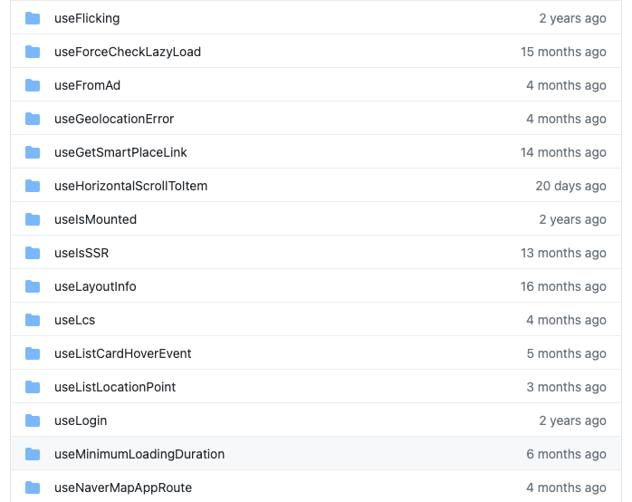
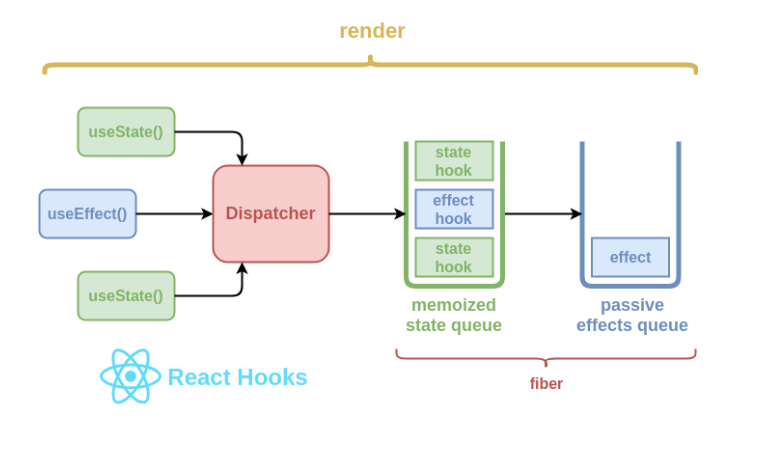

### React Hooks 🎣 <!-- .element: class="green" -->

-----

#### Hooks are future of React!

-----

#### What are Hooks?

<div class="fragment">
  <strong class="yellow">Functional Component</strong>에서 <strong class="yellow">stateful logic</strong>을 <br/>사용할 수 있게 해주는 함수 모음.
</div>
<br/>
<div class="fragment">
component에서 stateful logic을 분리하여 <br/><strong class="yellow">component는 view render에만 집중</strong>할 수 있게 함.
</div>

-----

#### Motivation

<iframe
  data-src="https://reactjs.org/docs/hooks-intro.html#motivation"
  data-preload
  width="1400px"
  height="500px"
  allowTransparency="true"
  style="background: #FFFFFF;"
></iframe>

-----

### 📌 State Hook

-----

<div class="center-code">

```js
const [state, setState] = useState(initialState);
```

```js
setState(newState);
```

</div>

<div class="fragment">

- <strong class="yellow">setState(newState)</strong> 호출 되면 state update가 되고 component가 re-render 됨
- `state: any`
  - number, string, array, object...
- 한 component에서 useState 여러번 사용해도 됨

</div>

-----

#### Functional updates

<div class="center-code">

```js
setState((previousState) => nextState)
```

</div>

<p style="font-size:smaller">setState()에 <strong class="yellow">update 함수</strong> 전달 가능</p>
<p style="font-size:smaller">한 번의 render에 <strong class="yellow">여러번</strong> setState() 호출 하는 경우 사용</p>
<p style="font-size:smaller">setState() 호출로 <strong class="yellow">기존 state는 대체</strong> 됨 (not merge)</p>

-----

#### Lazy initial state

<div class="center-code-wide">

```js
const [state, setState] = useState(() => {
  const initialState = someExpensiveComputation(props);
  return initialState;
});
```

</div>

<br/>
<strong class="yellow">계산 비용이 비싼 로직</strong>을 initial render에 한 번만 호출

-----

#### state 변경 감지

<div style="display:flex">
  <div style="flex-grow:1">
    <p style="padding-top: 30px;font-size:smaller;">
      state 값 변경은 <a href="https://developer.mozilla.org/en-US/docs/Web/JavaScript/Reference/Global_Objects/Object/is#description">Object.is</a> 비교
      <br/>
      <small>component 내부 객체/배열 생성은 매번 다른 reference를 갖기 때문에 다른 state로 인식</small>
      <br/>
      <br/>
      <br/>
      동일 state로 업데이트 되면 render 되지 않음
    </p>
  </div>
  <div style="flex-grow:1">
    
  </div>
</div>

-----

### ⚡️ Effect hook

-----

#### Effect?

<div class="fragment">
  <strong class="yellow">Side effect</strong>

  <div style="font-size:30px" class="fragment">

- Data fetching
- Setting up a subscription(eg. eventHandler)
- Manually changing the DOM
- timers, logging...

  </div>

  <p class="fragment">React's purely <strong class="yellow">functional world</strong> <span class="fragment"> => <strong class="yellow">imperative world</strong></span></p>
</div>

-----

#### useEffect

<div class="center-code-wide">

```js
useEffect(didUpdate, [dependency]);
```
<!-- .element: style="font-size:1em;" -->

</div>

<p style="font-size:smaller" class="fragment">coponent <strong class="yellow">render가 완료된 후</strong>에 실행</p>
<p style="font-size:smaller" class="fragment"><strong class="yellow">dependency</strong> 추가하여 특정 값이 변경된 경우에만 실행하도록 설정</p>
<p style="font-size:smaller" class="fragment">dependency 없는 경우 render 후에 항상 실행</p>
<p style="font-size:smaller" class="fragment">👉 무한루프 주의</p>

-----

<p style="font-size:smaller">useEffect 호출은 <strong class="yellow">browser paint를 block 하지 않음</strong> => 반응성 향상</p>
<br/>
<p style="font-size:smaller" class="fragment">관심 주제에 따라 <strong class="yellow">useEffect를 나누어서 사용</strong> 추천</p>
<p style="font-size:25px" class="fragment">관심 주제가 여러개면 여러개의 useEffect를 사용하는 것이 유지보수에 좋음</p>

-----

#### 🧹cleanup effect

<p style="font-size:smaller">useEffect()의 <strong class="yellow">return으로 cleanup function 전달</strong> 가능</p>
<p style="font-size:30px" class="fragment"><strong class="yellow">다음 useEffect() 실행 전</strong>에 이전 useEffect()의 cleanup function 호출 됨</p>
<p style="font-size:smaller" class="fragment">component <strong class="yellow">unmount 될 때</strong>도 호출</p>

-----

### useRef

-----

#### When to use useRef?

<p style="font-size:smaller"><strong class="yellow">DOM 접근</strong>에 사용</p>
<p style="font-size:smaller"><strong class="yellow">render에 영향을 주지 않는</strong> mutable data 관리에 편리</p>

-----

#### 그 외의 hooks

<iframe
  data-src="https://reactjs.org/docs/hooks-reference.html"
  data-preload
  width="1400px"
  height="500px"
  allowTransparency="true"
  style="background: #FFFFFF;"
></iframe>

-----

#### 💡 Building Your Own Hooks

<div style="display:flex">
  <div style="flex-grow:1">
    <p style="padding-top: 30px;font-size:smaller;">
      stateful logic <strong class="yellow">재사용</strong>
      <br/>
      component <strong class="yellow">가독성</strong>을 위해
    </p>
  </div>
  <div style="flex-grow:1">
    
  </div>
</div>

-----

#### ✌️ Rules of Hooks

1. Only Call Hooks at the Top Level
1. Only Call Hooks from React Functions

<br/>
<br/>
<p style="font-size:smaller">[필수] eslint-plugin-react-hooks 추가하여 lint 도움 받기</p>
<p style="font-size:smaller">[참고] lint 도움을 받기 위해 custom hook 들은 use prefix를 붙인다.</p>

-----

#### Under the hood of React hooks

 <!-- .element: style="height:500px" -->

-----

#### Benefit of hooks

- logic 재사용성
- 간결함, 응집도

-----

#### 10 React Hooks Explained

<iframe
  width="1200"
  height="450"
  src="https://www.youtube.com/embed/TNhaISOUy6Q"
  title="YouTube video player"
  allow="accelerometer; autoplay; clipboard-write; encrypted-media; gyroscope; picture-in-picture"
  allowfullscreen>
</iframe>
