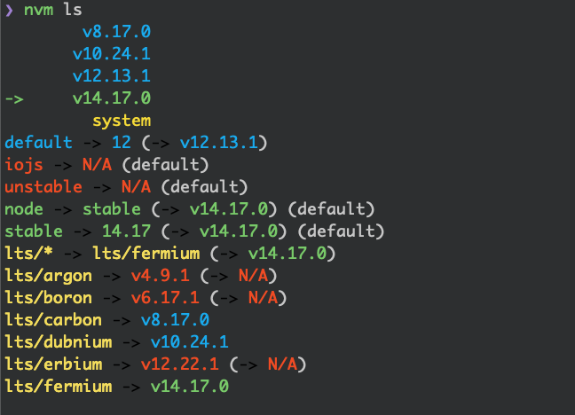
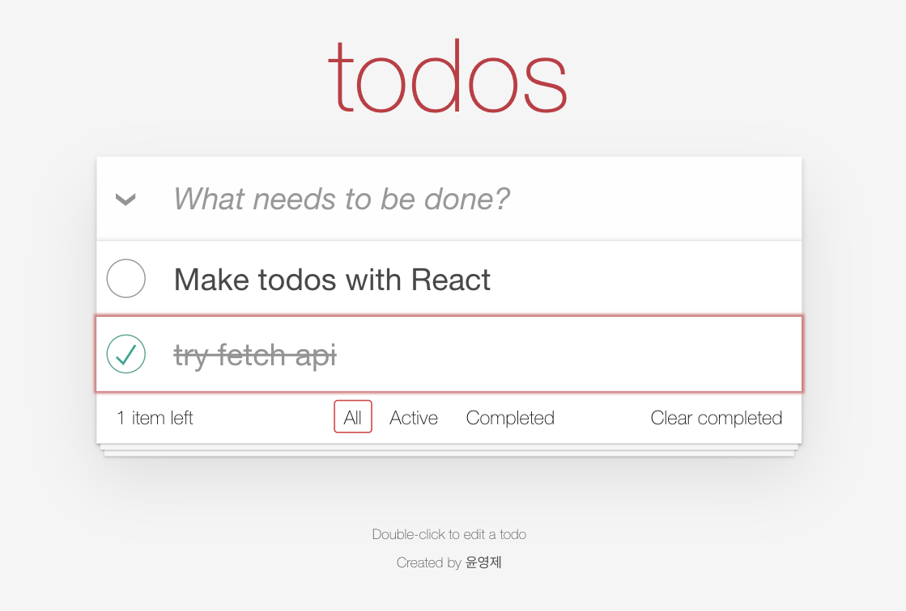
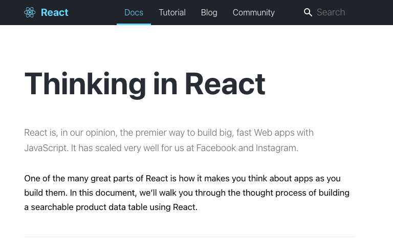
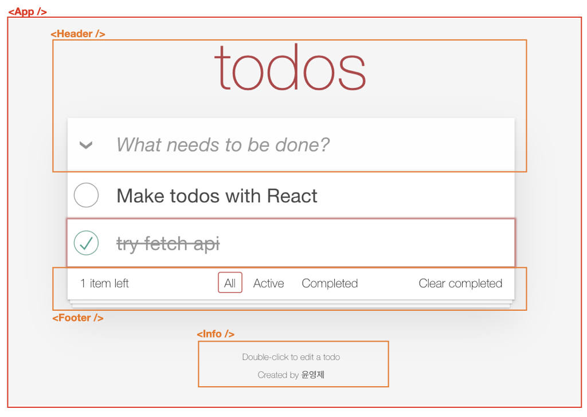
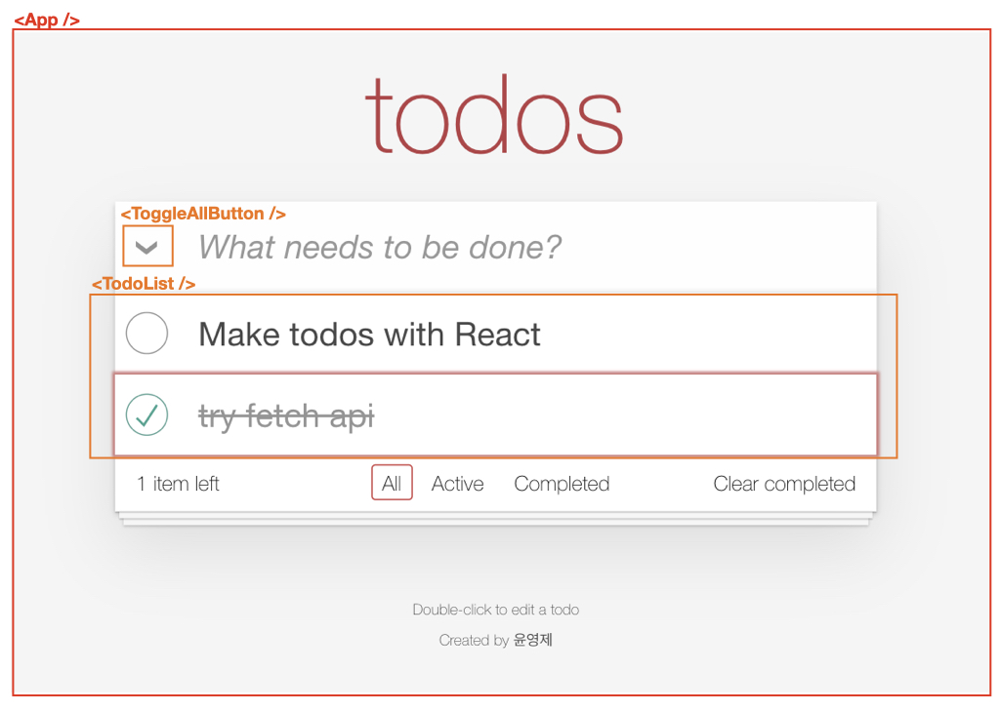
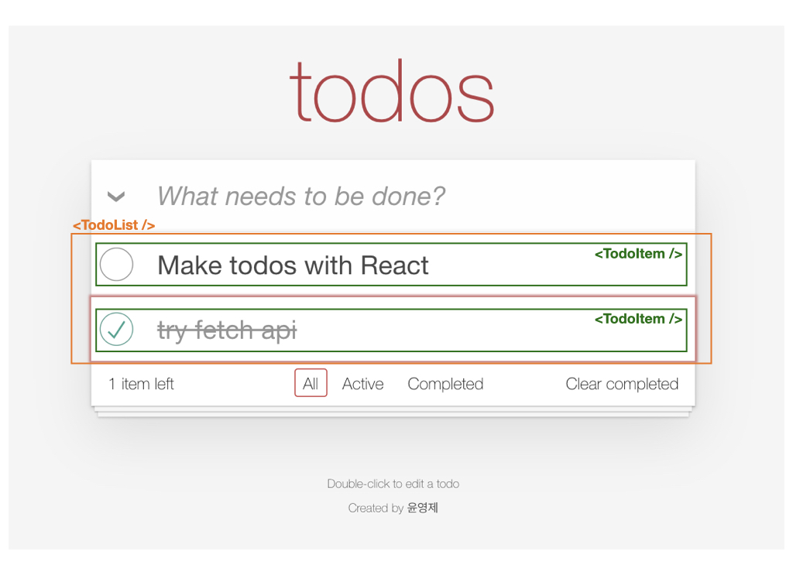
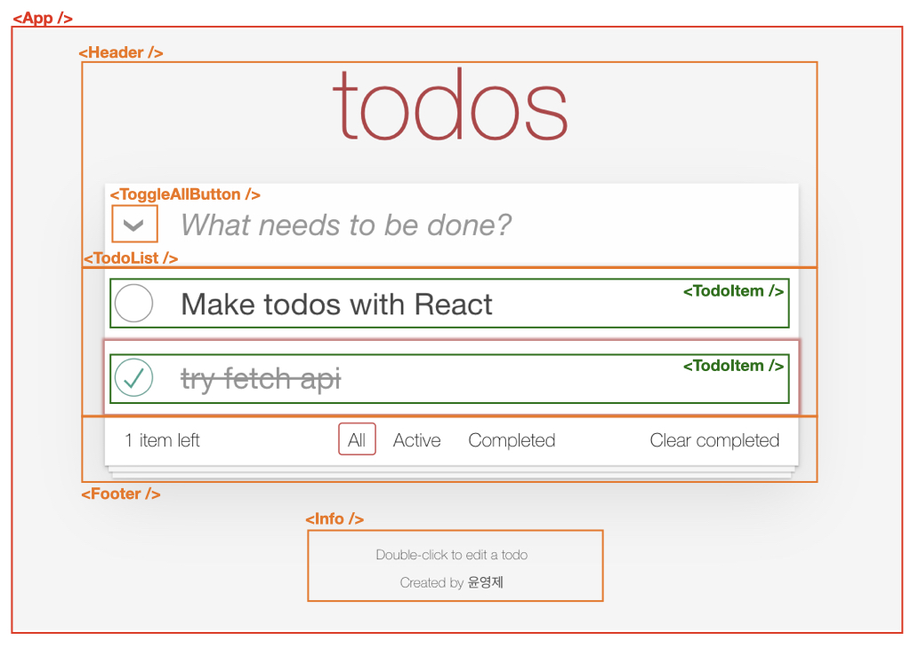

### Table of Contents

1. 📌 오늘 목표  <!-- .element: class="fragment highlight-current-yellow" -->
1. 📦 Before start <!-- .element: class="fragment highlight-current-yellow" -->
1. Wrap up! - React, Redux ⚛️ <!-- .element: class="fragment highlight-current-yellow" -->
1. 🛠 무엇을 만들까? <!-- .element: class="fragment highlight-current-yellow" -->
1. 🤔 Thinking in React <!-- .element: class="fragment highlight-current-yellow" -->
1. Let's code 👨‍💻👩‍💻 <!-- .element: class="fragment highlight-current-yellow" -->

-----

### 📌 오늘 목표 <!-- .element: class="green" -->

-----

#### 오늘 목표

- React로 간단한 SPA 작성해 보기 <!-- .element: class="fragment" -->
- Front-end 개발의 재미 느껴보기 <!-- .element: class="fragment" -->

-----

### 📦 Before Start <!-- .element: class="green" -->

-----

#### Node.js 설치

<iframe
  data-src="https://nodejs.org/ko/about/releases/"
  data-preload
  width="1200px"
  height="500px"
></iframe>

-----

#### nvm

 <!-- .element: style="height:450px" -->

windows? - [Windows에 NodeJS 설치](https://docs.microsoft.com/ko-kr/windows/dev-environment/javascript/nodejs-on-windows)

-----

#### yarn

- package manager by Facebook
- Creact-react-app 에서 기본으로 사용

<div style="width: 700px;margin: 0 auto;">

```sh
❯ npm install -g yarn
```

</div>

-----

#### Dev tools 설치 🛠

- [React Developer Tools](https://chrome.google.com/webstore/detail/react-developer-tools/fmkadmapgofadopljbjfkapdkoienihi?hl=ko)
- [Redux DevTools](https://chrome.google.com/webstore/detail/redux-devtools/lmhkpmbekcpmknklioeibfkpmmfibljd?hl=ko)

-----

###  Wrap up! <!-- .element: class="green" -->

-----

### ⚛️ React

- Declarative views <!-- .element: class="fragment" -->
- Component-Based <!-- .element: class="fragment" -->

-----

#### React Component

<p class="fragment white">
  function(props)
  <span class="fragment"> => </span>
  <span class="fragment">React Element</span>
</p>

-----

### Redux

- <!-- .element: class="fragment" --> <strong class="yellow">Flux 패턴</strong> 구현체
- <!-- .element: class="fragment" --> Single Directional Data Flow
- <!-- .element: class="fragment" --> <strong class="yellow">함수형 프로그래밍</strong> 지향

-----

### 무엇을 만들까? 🛠 <!-- .element: class="green" -->

-----

### TodoMVC

<iframe
  data-src="https://todomvc.com/"
  data-preload
  width="1200px"
  height="500px"
></iframe>

-----

### 기본 spec

<div style="display:flex">
  <div style="flex-grow:1">
    
  </div>
  <div style="flex-grow:2">
    <ul style="padding-top: 30px;">
      <li> 미완료 잔여 Todo 수 노출</li>
      <li> 새로운 Todo 입력</li>
      <li> 완료/미완료 toggle</li>
      <li> Todo item 삭제</li>
    </ul>
  </div>
</div>

-----

### 추가 spec

<div style="display:flex">
  <div style="flex-grow:1">
    
  </div>
  <div style="flex-grow:2">
    <ul style="padding-top: 30px;">
      <li>완료여부 필터 기능</li>
      <li>Todo item double click 시 수정</li>
      <li>전체 Todo 일괄 완료</li>
      <li>완료한 Todo 일괄 삭제</li>
    </ul>
  </div>
</div>

<div style="padding-top:50px;font-size:30px">참고) <a href="https://github.com/tastejs/todomvc/blob/master/app-spec.md">전체 spec</a></div>

-----

### Single Page Application

<iframe
  data-src="../../cra/build/todos.html"
  data-preload
  width="1200px"
  height="500px"
></iframe>

-----

### Markup

<span>📌 React 구현에 집중하기 위해</span></br>
<span>Markup은 template 사용합니다.</span>

<a href="https://github.com/tastejs/todomvc-app-template">Todo template</a>

-----

### Thinking in React 🤔 <!-- .element: class="green" -->

-----

 <!-- .element: style="height:450px" -->

[우리말](https://ko.reactjs.org/docs/thinking-in-react.html) | [English](https://reactjs.org/docs/thinking-in-react.html)

-----

1. 목업으로 시작하기 <!-- .element: class="fragment highlight-current-yellow" -->
2. UI를 Component 계층 구조로 나누기 <!-- .element: class="fragment highlight-current-yellow" -->
3. React로 정적인 버전 만들기 <!-- .element: class="fragment highlight-current-yellow" -->
4. UI state에 대한 완벽하면서 최소한의 표현 찾기 <!-- .element: class="fragment highlight-current-yellow" -->
5. State를 어디에 둘지 정하기 <!-- .element: class="fragment highlight-current-yellow" -->
6. 역방향 Data Flow 추가하기 <!-- .element: class="fragment highlight-current-yellow" -->

-----

1. 목업으로 시작하기 <!-- .element: class="yellow" -->
2. UI를 Component 계층 구조로 나누기
3. React로 정적인 버전 만들기
4. UI state에 대한 완벽하면서 최소한의 표현 찾기
5. State를 어디에 둘지 정하기
6. 역방향 Data Flow 추가하기

-----

Todo 데이터 정의하기

<div style="display:flex">
  <div style="flex-grow:1">
    
  </div>
  <div class="fragment" style="width: 700px;margin: 0 auto;">

```js [|2-6|7-11]
const MOCK_DATA = [
  {
    id: 'some-random-value-0',
    name: 'Make todos with React',
    completed: false,
  },
  {
    id: 'some-random-value-1',
    name: 'try fetch api',
    completed: true,
  }
];
```

  </div>
</div>

-----

1. 목업으로 시작하기
2. UI를 Component 계층 구조로 나누기 <!-- .element: class="yellow" -->
3. React로 정적인 버전 만들기
4. UI state에 대한 완벽하면서 최소한의 표현 찾기
5. State를 어디에 둘지 정하기
6. 역방향 Data Flow 추가하기

-----

<!-- .slide:data-transition="none" -->


-----

<!-- .slide:data-transition="none" -->


-----

<!-- .slide:data-transition="none" -->


-----

<!-- .slide:data-transition="none" -->


-----

1. 목업으로 시작하기
2. UI를 Component 계층 구조로 나누기
3. React로 정적인 버전 만들기 <!-- .element: class="yellow" -->
4. UI state에 대한 완벽하면서 최소한의 표현 찾기
5. State를 어디에 둘지 정하기
6. 역방향 Data Flow 추가하기

-----

### Let's code! 👨‍💻 👩‍💻 <!-- .element: class="green" -->

-----

#### Open the terminal

```sh [1|2-3|4|5|6]
❯ npx create-react-app todo
# for typescript users!
# ❯ npx create-react-app todo --template typescript
... install and setting 📦
❯ cd todo
❯ npm start
```

-----

<!-- .slide:data-background-iframe="../../cra/build/index.html" -->

-----

### Prepare Markup

- [template](https://github.com/tastejs/todomvc-app-template/blob/master/index.html) 붙여넣기
- css 적용 하기 <small>with</small> [todomvc-app-css](https://github.com/tastejs/todomvc-app-css)

<div class="fragment" style="width: 700px;margin: 0 auto;">

```sh
❯ yarn add todomvc-app-css
```

```js
import 'todomvc-app-css/index.css';
```

</div>

-----

#### Break The UI Into A Component Hierarchy

- Component 분리하기

<small>(결과) [git branch: 2-component-hierarchy](https://github.com/youngje/react-todo/tree/2-component-hierarchy)</small>

-----

#### Build a Static version in React

- `props` 만 사용하여 App 구성하기
- `state` 사용 금지

<small>(결과) [git branch: 3-static-react](https://github.com/youngje/react-todo/tree/3-static-react)</small>


-----

#### Build a Static version in React

- `props` 만 사용하여 App 구성하기
- `state` 사용 금지

<small>(결과) [git branch: 4-add-state-basic-spec](https://github.com/youngje/react-todo/tree/4-add-state-basic-spec)</small>

-----

#### Refactor with Redux

- [Redux 시작하기](https://ko.redux.js.org/introduction/getting-started/)
- [Redux toolkit overview](https://redux.js.org/redux-toolkit/overview)

<div style="width: 700px;margin: 0 auto;">

```sh
❯ yarn add @reduxjs/toolkit react-redux
```

</div>

<small>(결과) [git branch: 6-refactor-with-redux](https://github.com/youngje/react-todo/tree/6-refactor-with-redux)</small>
